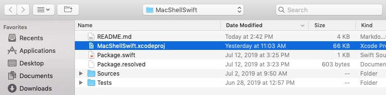
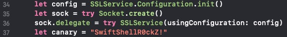
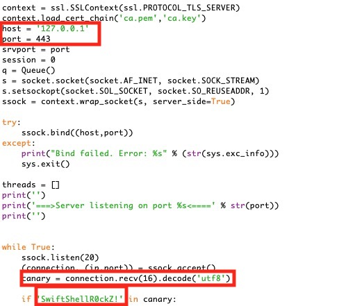
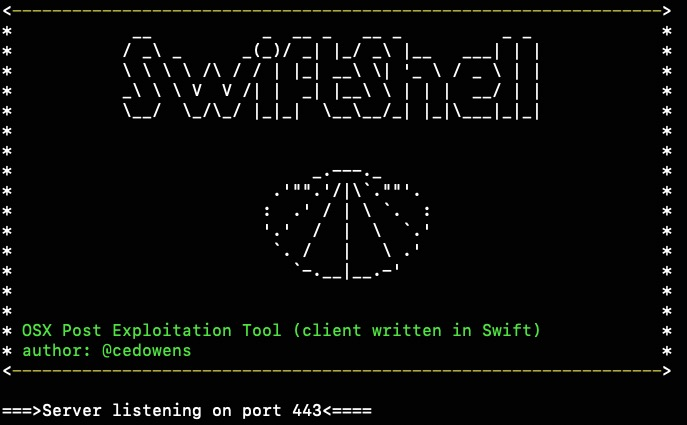
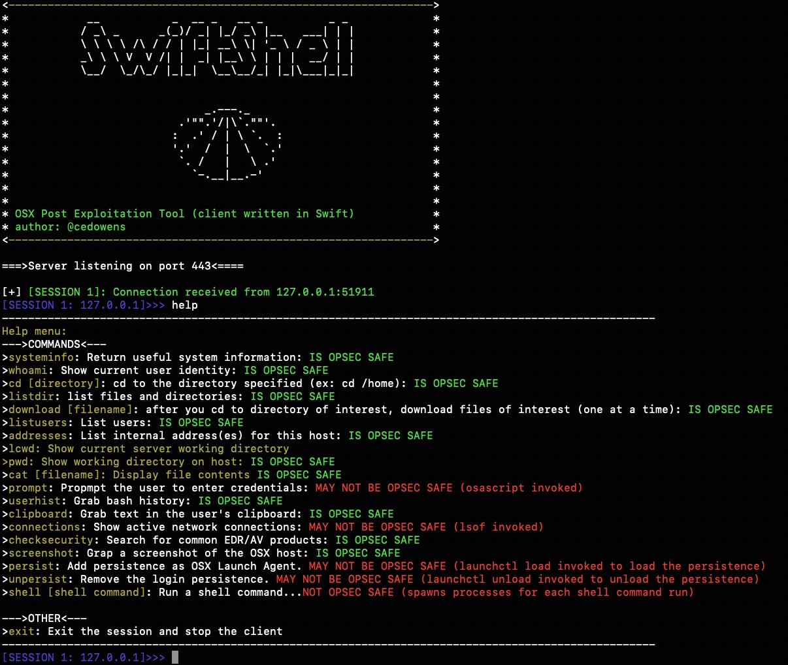
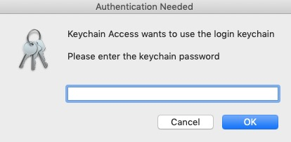
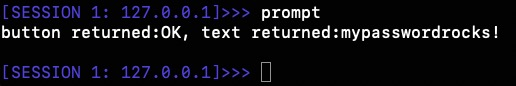

# SwiftShell

SwiftShell is a macOS post exploitation tool written in Swift using encrypted sockets. This tool consists of two parts: a server script and a client binary.

More info below:

**_In Swift Code (i.e., generating the client binary)_**
1. Open the xcodeproj file for SwiftShell in Xcode

2. Edit the main.swift code as needed in Xcode, including the canary string (ensuring it matches what is in the server) and the destination IP/hostname and port.

3. From a terminal cd into the MacShellSwift directory and run: "swift build" to generate the binary. The binary will be dropped in the .build/debug folder inside of the MacShellSwift folder and will be named MacShellSwift

4. After you set things up server side, you can then copy the binary over to the client and execute it (it is assumed you have access to the target macOS host already).

**_On C2 Server:_**

1. Set up ssl (note: use a key size of at least 2048)

-From a terminal, cd into the same directory as swiftshell-server.py and run this openssl command: _openssl req -new -newkey rsa:2048 -nodes -out ca.csr -keyout ca.key_

-Answer the prompts and then run the following openssl command: _openssl x509 -trustout -signkey ca.key -days 365 -req -in ca.csr -out ca.pem_

_*note: the server script is hard-coded to use ca.pem and ca.key, but you can change those names of course (just make sure you also change the name in the swiftshell-server.py file).

2. Change the "host = '127.0.0.1'" string to the server IP address and the "port = 443" string to the listening port on the server. Also make sure the canary string matches the string in the client code. If you change the canary strig, you will also need to change the connection.recv(16) to whatever length the new string is.

3. Save and run the server:
Usage: sudo python3 swiftshell-server.py

**_Using SwiftShell_**

1. After you receive a connection, you can use the "help" command on the server to get a list of built-in commands available. You can enter one of these commands or a shell command (ex: whoami or id)

Each command is pretty straightforward and contains a note on whether each is OpSec safe (i.e., easily detectable)

**prompt** Command: This will pop up a fake Keychain authentication prompt asking the user to authenticate with their keychain password. Either the user will cancel the prompt or enter their password. The results are sent back to the server.

Here is what the fake authentication prompt looks like:

And here is an example of credentials being captured and sent to the server:

**history** Command: Greps the bash history file on the target and then returns interesting IP addresses (ex: machines that the user may have ssh'd to)

**clipboard** Command: Returns the results of what is currently on the user's clipboard

**persist** Command: Uses Launch Agent persistence

**remove** Command: removes the Launch Agent persistence

**connections** Command: View processes with network connections

**addresses** Command: Get a list of internal addresses assigned to the macOS host

**listusers** Command: Get a list of user accounts on the macOS host

**download** Command: Download file of interest from the macOS host (note: user context must have the needed permissions)

**checksecurity** Command: Check for some common EDR/AV vendors on the macOS host

----------

**_Limitations_**

-While the server does accept multiple client connections, you cannot jump between sessions currently. The server will interact with the first session it receives and once the operator exits that session it will move on to the next session in the queue.

-I have not yet developed any phishing payloads for SwiftShell (just the mach-o binary that is built from the project).

-This tool is serves as a simple POC for post exploitation on macOS using Swift. The server as written is not robust enough for red team operations usage. This was written to help blue teams proactively measure detections against these methods and to help red teams with ideas around using macOS internals for post exploitation.

-----------

**_DISCLAIMER_**

This is for academic purposes and should not be used maliciously or without the appropriate authorizations and approvals.

